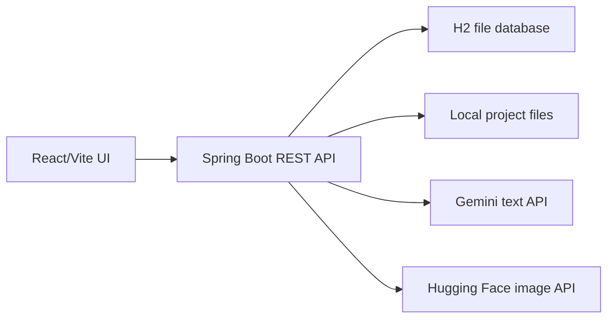
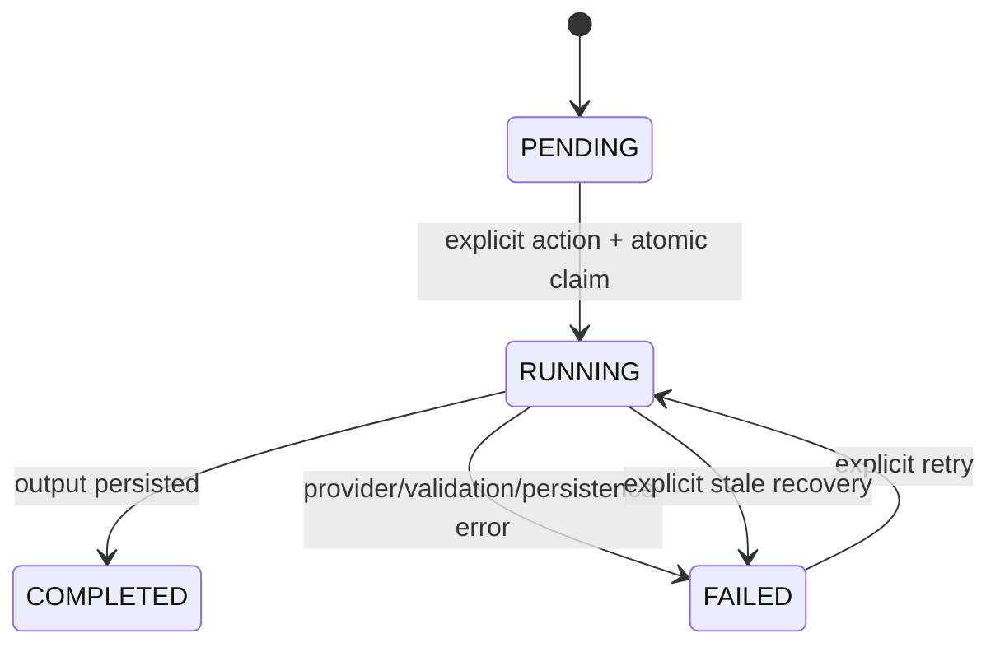

# Current architecture

Gradion is a local application with one React frontend, one Spring Boot backend, H2 file storage, and project files on disk.



The frontend sends explicit actions and renders server state. The backend owns validation, ordering, ownership, provider calls, persistence, and filesystem access.

## Runtime and persistence

H2 runs in file mode using `jdbc:h2:file:./data/gradion;DB_CLOSE_ON_EXIT=FALSE`. It stores users, sessions, projects, five project steps, characters, one chapter per project, Gemini references, and image metadata.

```text
data/gradion.mv.db
data/projects/<project-id>/book.txt
data/projects/<project-id>/portraits/<character-id>.png
data/projects/<project-id>/illustrations/<chapter-id>.png
```

Files are written to temporary siblings and atomically moved. Media endpoints check project ownership before reading bytes; paths are never returned to the browser.

## Pipeline state machine



The ordered keys are `STYLE`, `CHARACTERS`, `PORTRAITS`, `CHAPTERS`, and `ILLUSTRATIONS`. Only the first incomplete step may run. Claims lock the project row, save a run token and backend instance ID, and commit before external work. Completion/failure requires the same run token.

Stale recovery is explicit and only applies to an old run owned by a previous backend instance. A slow call owned by the current process is not recovered solely because it exceeds the threshold.

## Gemini text boundary

`GeminiGateway`/`HttpGeminiGateway` handle text/context only:

- upload and validate the persisted book reference
- create/rebuild book and style contexts
- generate STYLE
- generate adult CHARACTERS with structured JSON
- generate one CHAPTER with structured JSON

References are persisted and reused. If a remote reference is unavailable, the backend rebuilds the minimum context from the local book, style, and character outputs. Calls are user-triggered with no automatic retry.

## Image boundary

`ImageGenerationGateway` is the mockable boundary. `HuggingFaceImageGateway` is the only real implementation and exposes portrait and illustration generation.

```env
HF_TOKEN=...
HF_PROVIDER=nscale
HF_IMAGE_MODEL=black-forest-labs/FLUX.1-schnell
```

The configured Nscale route is text-to-image. PORTRAITS use character prompts. ILLUSTRATIONS use a composed prompt containing persisted style, chapter title, chapter prompt, character names, and exact appearance prompts. Portrait bytes are not sent as references because the endpoint does not support that input.

## API surface

| Method | Path | Purpose |
| --- | --- | --- |
| `POST`/`GET`/`DELETE` | `/api/session` | Identity lifecycle |
| `GET` | `/api/projects` | Owned project list |
| `POST` | `/api/projects` | Create project and save book |
| `GET` | `/api/projects/{id}` | Owned project detail |
| `POST` | `/api/projects/{id}/steps/{step}/run` | Claim and execute a step |
| `POST` | `/api/projects/{id}/steps/{step}/recover` | Recover previous-instance stale run |
| `GET` | `/api/projects/{id}/media/{characterId}` | Owned portrait bytes |
| `GET` | `/api/projects/{id}/illustrations/{chapterId}` | Owned illustration bytes |

Unauthenticated requests return `401`; absent/unowned resources return `404`; illegal order or an existing run returns `409`; provider/validation failures return safe failed-step state.

## Testing

Backend integration tests use fake Gemini and image gateways. They cover ordering, ownership, structured output validation, retries, duplicate claims, stale recovery, filesystem persistence, and media access. Frontend Vitest tests cover identity, projects, pipeline states, portraits, chapter metadata, and illustrations. No automated test calls external providers.

## Explicit non-goals

No password/OAuth infrastructure, queues/workers, schedulers, SSE/WebSockets, automatic provider retry, external database, or additional pipeline step is included.
