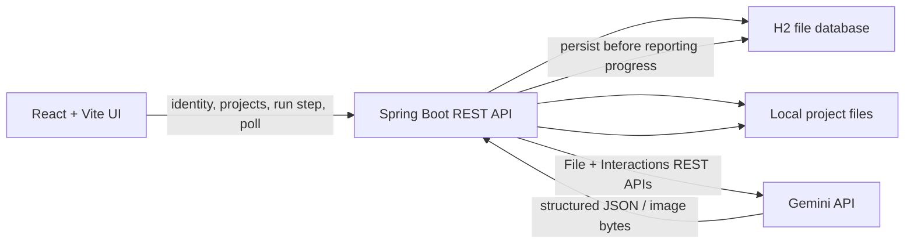
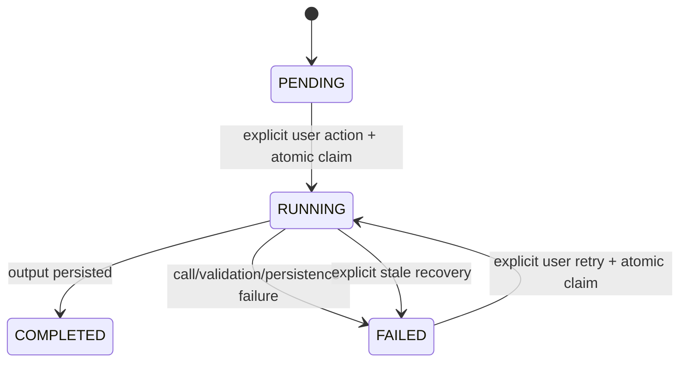

# Proposed Architecture

This is a deliberately small local application: one browser frontend, one backend process, one embedded file database, and project files on disk. The persistence and state model are concrete enough to implement, while the choices called out as open remain subject to a real engineering decision rather than being back-filled into `DECISIONS.md`.

## System flow



The frontend never receives the Gemini key and never decides whether a step is legal. It renders server state, sends an explicit action for the current step, polls while work is running, and reads protected media through the backend.

The backend owns identity context, project ownership, validation, pipeline transitions, Gemini calls, and file paths. It commits a `RUNNING` claim before making an external call and commits every output before exposing it as complete.

## Proposed persistence

Use H2 in file mode through Spring's normal persistence support. It fits a single local backend, survives restarts, supports transactions and row locking, and avoids operating another service. SQLite is similarly small but adds less-familiar Java integration and does not improve this workload. JSON files would save a database dependency but require custom locking, atomic replacement, indexing, and recovery code; that is more application code around the riskiest requirement.

This is a proposed baseline, not yet a recorded human/AI decision. Confirm it while bootstrapping the repository, then record the real discussion and cost in `DECISIONS.md`.

The database stores metadata and state, not book contents or image bytes. A development layout is:

```text
data/
  db/gradion.mv.db
  projects/<project-id>/book.txt
  projects/<project-id>/characters/<character-id>.<ext>
  projects/<project-id>/chapters/<chapter-id>.<ext>
```

Only server-generated UUIDs enter paths. Files are written to a temporary sibling and atomically moved into place before the database points to them. A media controller verifies project ownership before returning a file; the application does not expose `data/` as a public static directory.

## Domain model

- **User:** id, normalized unique email, display name, created time.
- **Project:** id, owner id, title, book path, created time, Gemini uploaded-file reference, and root text interaction id.
- **ProjectStep:** project id, step key, position, lifecycle, run token, started/finished times, error summary, and latest interaction id. Five rows are seeded at project creation.
- **Character:** id, project id, position, name, prompt, image lifecycle/path, and image interaction id. The service and response schema cap rows at two and require adults only.
- **Chapter:** id, project id, position, name, prompt, referenced character names, image lifecycle/path, and image interaction id. The service and response schema cap rows at one.

Project list status is derived instead of stored twice: no completed steps is **Draft**, all five completed is **Done**, and every other valid state is **In progress**.

## Pipeline state model

Each step uses `PENDING`, `RUNNING`, `COMPLETED`, or `FAILED`.



The ordered keys are `STYLE`, `CHARACTERS`, `PORTRAITS`, `CHAPTERS`, and `ILLUSTRATIONS`. A claim is legal only for the first non-completed row and only when every prior row is `COMPLETED`. Adding a future step means adding one key/handler and seeding another ordered row; it does not change the transition algorithm.

### Atomic claim and duplicate prevention

The run endpoint starts a short database transaction, locks the project row, loads its ordered steps, verifies ownership and ordering, and changes the requested step from `PENDING` or `FAILED` to `RUNNING` with a new random run token. It commits before calling Gemini.

A concurrent double-click or second tab blocks on the same project row, then observes `RUNNING` and receives a conflict/current-state response without calling Gemini. Completion and failure updates include the run token, so a late result from an invalidated run cannot overwrite newer state.

The Gemini work can remain on the request thread for this one-process local app. A client refresh may abandon the HTTP response, but the backend request continues; the refreshed page reads the persisted `RUNNING` state and polls. This avoids a queue or background-job framework while preserving the server-side guard.

### Failure, retry, and stuck recovery

An expected Gemini, parsing, or file failure marks only the active step `FAILED`, stores a short safe message, and leaves completed steps/items untouched. There is no retry loop in the HTTP client. The UI offers Retry for that same step, which uses the normal claim path.

A `RUNNING` row older than a configurable local threshold is shown as potentially stranded. Recovery is a separate user action: it verifies the age and run token, changes the row to `FAILED`, and does not call Gemini. The next Retry is also explicit. An external API cannot provide exactly-once execution after an unknown network outcome; stale recovery may repeat a call that finished remotely but was never persisted. The run token still prevents late data from corrupting state. Choose and document the threshold only after measuring real image latency.

Portraits and illustrations also have per-item lifecycle. After each image response, the backend atomically writes the file and updates that item. Polling therefore shows completed portraits immediately. Retrying an image step skips items whose files are already recorded, limiting cost and preserving progress.

## Gemini boundary

One `GeminiGateway` boundary hides REST payloads from pipeline state logic and is replaceable by a deterministic fake in tests. It must implement the Google notebook mechanics rather than an invented pipeline:

1. During the first Style attempt, upload the saved `book.txt` with the File API, create the root text interaction, and persist both references before continuing.
2. Generate or acknowledge the optional style through `previous_interaction_id`.
3. Generate adult character prompts through the text interaction chain with structured JSON output. Schema and application validation enforce `maxItems: 2`.
4. Start an image interaction with the style and image rules, then generate portraits sequentially, persisting each interaction id and image.
5. Generate the chapter prompt from the character-prompt interaction with structured JSON output and `maxItems: 1`.
6. Generate the chapter illustration by chaining from the portrait image interaction (or supplying the saved portrait references if validated against the current REST API) so character appearance is reused.

Persist references after every successful remote call. If Style fails after the book upload/root interaction, retry reuses those references and does not resend the book. Disable SDK/client automatic retries because the assessment requires every Gemini retry to be user-triggered.

Model IDs and exact REST request fields are intentionally not fixed here: they are time-sensitive and must be selected from the current official docs after checking image free-tier limits. The notebook's current model list is evidence, not a permanent configuration contract.

## API boundary

The likely minimal endpoints are:

| Method | Path | Purpose |
| --- | --- | --- |
| `POST` | `/api/session` | Validate name/email and create or load identity |
| `DELETE` | `/api/session` | Sign out |
| `GET` | `/api/projects` | List only the current user's projects |
| `POST` | `/api/projects` | Create from title plus pasted text or one `.txt` part |
| `GET` | `/api/projects/{id}` | Return full book text, all step states, and generated items |
| `POST` | `/api/projects/{id}/steps/{step}` | Claim and run the current step |
| `POST` | `/api/projects/{id}/steps/{step}/recover` | Mark an eligible stale run retryable; never invoke Gemini |
| `GET` | `/api/projects/{id}/media/{itemId}` | Stream an owned generated image |

All project lookups include owner identity. Return `400` for validation, `401` without identity, `404` for absent/unowned resources, `409` for illegal order or an existing run, and a safe `FAILED` step payload for Gemini errors. Never return raw provider responses, paths, stack traces, or secrets.

Whether identity is represented by an HttpOnly cookie or a simple server-issued token remains open. No choice changes the rule that every endpoint resolves an identity server-side and scopes data by owner.

## Frontend responsibilities

- Identity form with accessible validation and sign-out.
- Project list with empty/loading/error states, created date, derived status pill, and five-part progress.
- New project form with title and mutually exclusive pasted text/`.txt` input.
- Project detail with full readable book text, five-step stepper, generated style, character/chapter cards, and exactly one current action.
- Poll project detail at a modest fixed interval only while a step is `RUNNING`; stop on `COMPLETED` or `FAILED`. Polling is enough for at most two portraits and one illustration, so SSE/WebSocket is out of scope.
- Render per-item image lifecycle without clearing already completed cards; name the running step; expose step-specific Retry and stale Recover actions.

## Testing strategy

Backend tests focus on the state machine rather than controller volume: ordering, two concurrent claims with one winner, run-token completion, failed-step retry, stale recovery, restart persistence, hard 2/1 caps, ownership, and partial-image resume. A fake gateway runs all five steps without quota; narrow HTTP fixtures verify Gemini request/response mapping.

Frontend tests use React Testing Library and Vitest for a few consequential states: identity validation, empty/error project list, running/failed/stale detail, and partial portrait progress. Manual checks cover keyboard flow, responsive layout, refresh, second tab, and killing/restarting the backend mid-step.

`TESTING.md` is created or completed only after commands have actually run, and includes their exact real output. No coverage target or E2E framework is needed.

## Deliberate limits and open decisions

- **Proposed H2 file mode:** confirm against the chosen Spring persistence library before recording it as a decision.
- **Session representation:** choose HttpOnly cookie versus a small server-issued token during the identity slice.
- **Stale threshold:** measure real image latency; recovery must be explicit and must not auto-retry.
- **Polling interval:** start modestly and adjust only if UX testing shows a problem.
- **Gemini models and REST shapes:** verify current official docs and image quota immediately before integration.
- **Structured-output policy:** decide whether any invalid/oversized model output fails the step or is safely truncated; the persisted result can never exceed 2 characters or 1 chapter.

No Docker, deployment, WebSocket/SSE, attempt-history UI, sample books, or bonus media belongs in the first submission. Add one only after every required path is verified and time remains.

## Reference sources consulted

- [Google Gemini cookbook: Book illustration notebook](https://github.com/google-gemini/cookbook/blob/main/examples/Book_illustration.ipynb)
- [Gemini Interactions API](https://ai.google.dev/gemini-api/docs/interactions)
- [Gemini Files API](https://ai.google.dev/gemini-api/docs/files)
- [Gemini structured output](https://ai.google.dev/gemini-api/docs/structured-output)
- [Hugging Face Inference Providers](https://huggingface.co/docs/inference-providers/tasks/text-to-image) for portrait image generation
